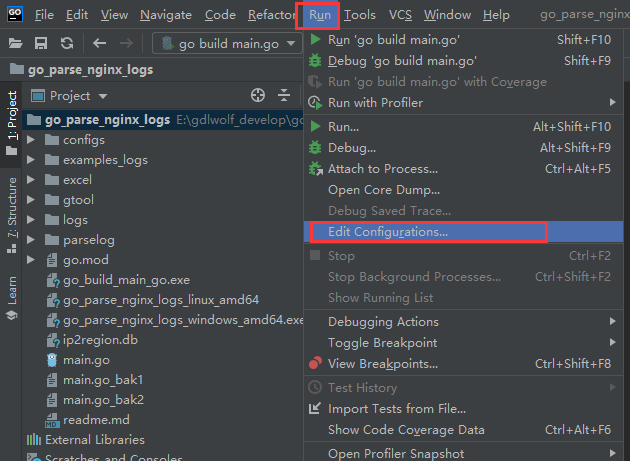
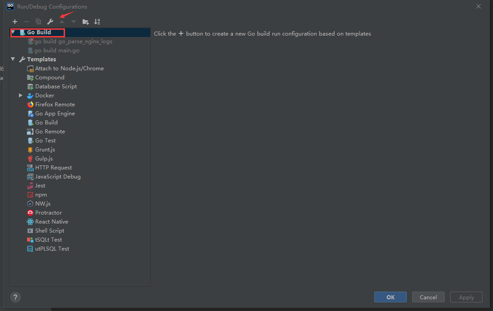
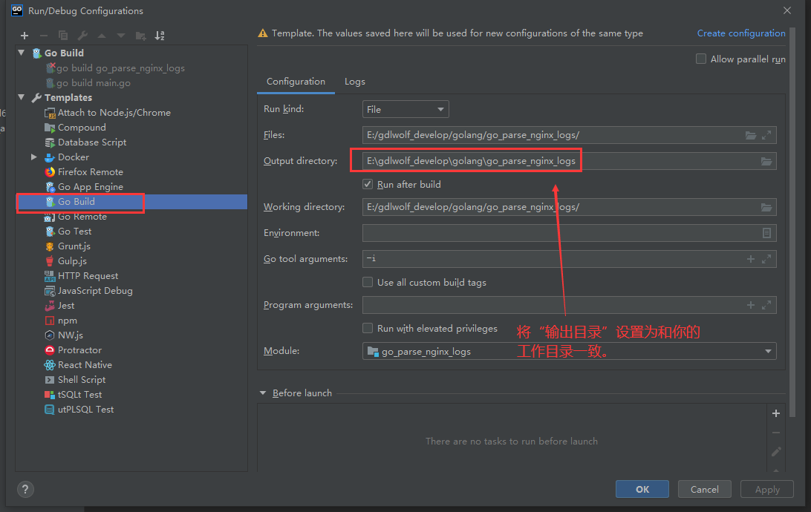

# 配置Goland

## 配置Goland的output Directory

Run--->Edit Configurations



Go Build ---> “扳手图标”






# 安装

```SH
go get -u github.com/spf13/viper
go get github.com/sirupsen/logrus
go get github.com/natefinch/lumberjack
go get gopkg.in/gomail.v2
https://godoc.org/gopkg.in/gomail.v2

# 将ip2region.db文件放到项目根目录下
go get github.com/lionsoul2014/ip2region/binding/golang
https://github.com/lionsoul2014/ip2region/tree/master/binding/golang


```

# 配置文件

配置文件是在项目根目录下的`configs/viper_config.yml`文件

# 初始化
在main.go中创建初始化函数

```GO
func init() {
	gtool.InitGtool()
}
```


# 使用
## 配置文件的使用

可通过如下类似形式获取配置文件中的配置项

```go
getString := viper.GetString("app.name")
fmt.Println(getString)
```


## 日志logrus的使用

在每个需要打印日志的go文件中导入

```GO
import log "github.com/sirupsen/logrus"
```

